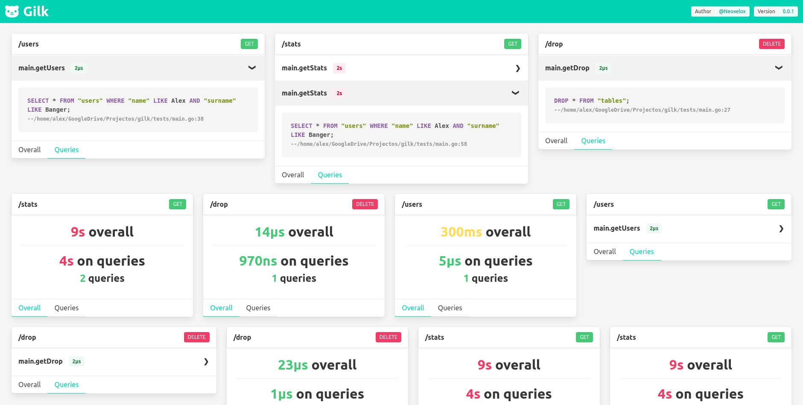

# gilk 
**`silk-like query profiler for golang` 🐻**


## What
Gilk is a simple, per request, query profiler inspired by [Django's Silk](https://github.com/jazzband/django-silk).



## Install
**`go get github.com/neoxelox/gilk`**

## Usage
The example is done with the standard `net/http` package.

You should be able to extrapolate the following example to any golang web framework.

```go
import (
    // ...
    "github.com/neoxelox/gilk"
    // ...
)

func main() {
    // ...
    go gilk.Serve(":8000")
    // ...
}

func someHandler(w http.ResponseWriter, r *http.Request) {
    ctx, endContext := gilk.NewContext(r.Context(), r.URL.Path, r.Method)
	defer endContext()

	r = r.WithContext(ctx)
    // ...
    repo.SomeQuery(ctx, something)
    // ...
    repo.AnotherQuery(ctx, another)
    // ...
}

func (r *repo) SomeQuery(ctx context.Context, something string) {
    // ...
    someReturn := r.DB.MyQuery(ctx, `
        SELECT * FROM "users" WHERE "id" = $1;`,
        310720)
    // ...
}

func (db *Database) MyQuery(ctx context.Context, query string, args ...interface{}) {
    ctx, endQuery := gilk.NewQuery(ctx, query, args...)
	defer endQuery()

    db.Query(query, args...)
    // ...
}
```

**_Note!_** defer calls of `NewContext` should be the first thing of you handler and `NewQuery` should be as close as possible to the real database query, in order to improve the statistics.

Look for more examples [`here`](examples).

See [`GoDev`](https://pkg.go.dev/github.com/neoxelox/gilk) for further documentation.

## Configuration
There are a few things you can configurate to improve your experience:
- **`gilk.Mode`** : set to `gilk.Disabled` to disable caching contexts, queries and serving them. Set to `gilk.Enabled` to enable. Default: `gilk.Enabled`.
- **`gilk.SkippedStackFrames`** : number of stack frames to be skipped when the caller of the query context is captured. Default: `1`.
- **`gilk.CacheCapacity`** : capacity of the context cache, `gilk.Reset()` needs to be called afterwards in order to make the change. Default: `50`.
- **`gilk.QueryGreenColorLatency`** : green color maximum latency threshold for a single query. Default: `100 * time.Millisecond`.
- **`gilk.QueryYellowColorLatency`** : yellow color maximum latency threshold for a single query. Default: `250 * time.Millisecond`.
- **`gilk.ContextGreenColorLatency`** : green color maximum latency threshold for a single context. Default: `250 * time.Millisecond`.
- **`gilk.ContextYellowColorLatency`** : yellow color maximum latency threshold for a single context. Default: `500 * time.Millisecond`.
- **`gilk.QueriesGreenColorLatency`** : green color maximum latency threshold for all the queries within a context. Default: `100 * time.Millisecond`.
- **`gilk.QueriesYellowColorLatency`** : yellow color maximum latency threshold for all the queries within a context. Default: `250 * time.Millisecond`.
- **`gilk.QueriesGreenColorNumber`** : green color maximum number threshold for queries within a context. Default: `10`.
- **`gilk.QueriesYellowColorNumber`** : yellow color maximum number threshold for queries within a context. Default: `15`.

## Serving UI
The most convenient way to work with Gilk is to use `gilk.Serve(port)` that launches a UI in the assigned port. However you can also serve the raw JSON data `gilk.ServeRaw(port)`.
At present, the queries shown in the Gilk UI are not "real/ready" SQL queries, the args are dummy-embedded into the SQL query.

## Contribute
Feel free to contribute to this project : ) .

## License
This project is licensed under the [MIT License](https://opensource.org/licenses/MIT) - read the [LICENSE](LICENSE) file for details.
